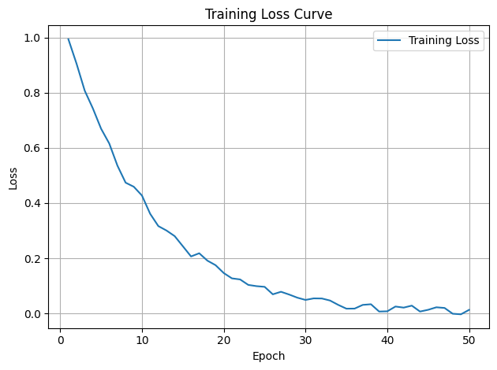
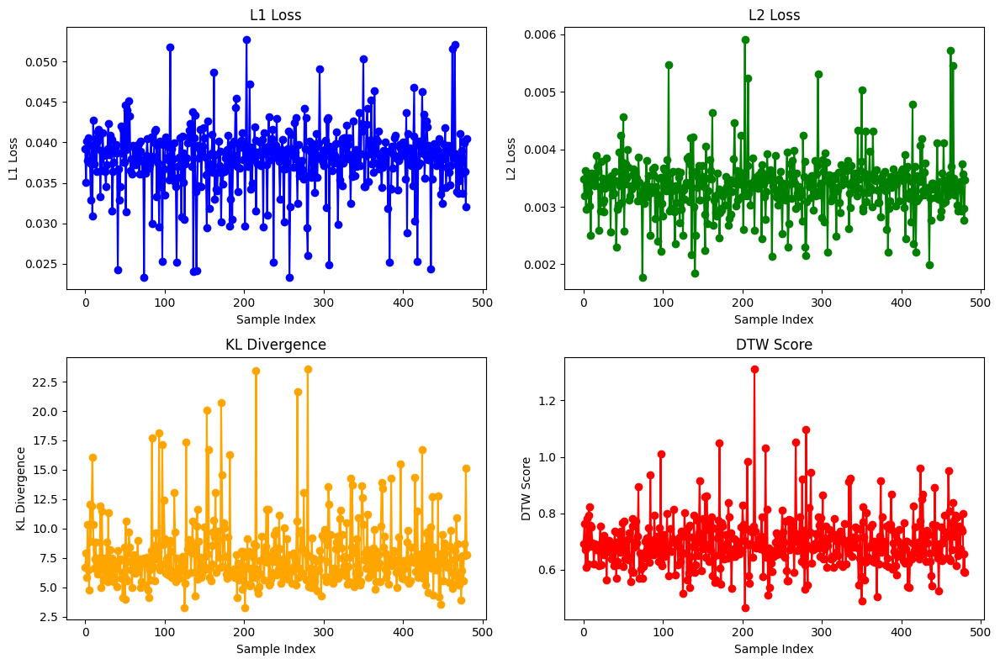

# :) Kokoro_TTS

An inference library for [Kokoro-82M](https://huggingface.co/hexgrad/Kokoro-82M). 

> **Kokoro** is an open-weight TTS model with 82 million parameters. With Apache-licensed weights, Kokoro can be deployed anywhere from production environments to personal projects.

### Usage
You can run this basic cell on [Google Colab](https://colab.research.google.com/).
```py
!pip install -q kokoro>=0.9.4 soundfile
!apt-get -qq -y install espeak-ng > /dev/null 2>&1
from kokoro import KPipeline
from IPython.display import display, Audio
import soundfile as sf
import torch
pipeline = KPipeline(lang_code='a')
text = '''
'''
generator = pipeline(text, voice='af_heart')
for i, (gs, ps, audio) in enumerate(generator):
    print(i, gs, ps)
    display(Audio(data=audio, rate=24000, autoplay=i==0))
    sf.write(f'{i}.wav', audio, 24000)
```
### Advanced Usage
You can run this advanced cell on [Google Colab](https://colab.research.google.com/).
```py
# Install kokoro
!pip install -q kokoro>=0.9.4 soundfile
# Install espeak, used for English OOD fallback and some non-English languages
!apt-get -qq -y install espeak-ng > /dev/null 2>&1

# Initalize a pipeline
from kokoro import KPipeline
from IPython.display import display, Audio
import soundfile as sf
import torch
pipeline = KPipeline(lang_code='a') # <= make sure lang_code matches voice, reference above.

```

---

## Dataset

- **Source**: Provided as `.wav` files and a metadat.csv file provided in this repo.
Metadata [DesiVocal_Dataset](https://www.google.com/url?q=https://www.google.com/url?q%3Dhttps://drive.google.com/file/d/1DibcZbSVOrFzkTEVzvXWaxKQddu6Vq2K/view?usp%253Dshare_link%26amp;sa%3DD%26amp;source%3Deditors%26amp;ust%3D1747072039782353%26amp;usg%3DAOvVaw1ReM5FJTzjDbdsX4oa8Zy3&sa=D&source=docs&ust=1747072039789531&usg=AOvVaw3Fxl61wHeAkijXt1BbLlhX)
- **Metadata**:
  - `wav_file`: Filename of the original audio
  - `transcript`: Ground truth text corresponding to the audio

**Colab Notebook**: My original work, based on the kokoro model for the given dataset, is present in both [kokoro_tts_1.ipynb](./kokoro_tts_1.ipynb) and [kokoro_tts_1.py](./kokoro_tts_1.py) formats in this repo.

OR

Directly open my colab notebook from here [Open in Google Colab](https://colab.research.google.com/drive/1SC8Lb0LqdQuaW6v4fODICUauU8oEAU7K#scrollTo=X8-5MeiqT9K_)


**Example**:
| wav_file | transcript |
|----------|------------|
| `13b2068a-2def-4f69-b4ba-168c4da30498.wav` | "I invite you to embark on a profound journey..." |

---

## Evaluation Metrics

We computed the following similarity metrics between original and synthesized audio:

| Metric | Description |
|--------|-------------|
| **L1 Loss** | Mean Absolute Error between waveforms |
| **L2 Loss** | Mean Squared Error between waveforms |
| **KL Divergence** | Divergence between mel-spectrogram distributions |
| **DTW Score** | Dynamic Time Warping alignment cost |

---
## Sample Results 
Sample results can be seen in :  [similarity_metrics.csv file](https://github.com/shifs999/Kokoro_TTS/blob/main/similarity_metrics.csv).

---

## Loss Plots

Visual summaries of the metrics across samples can be found in my colab notebook outputs: 
[Google_Colab](https://colab.research.google.com/drive/1SC8Lb0LqdQuaW6v4fODICUauU8oEAU7K#scrollTo=X8-5MeiqT9K_)

Metric Visuals





---

## Examples

Each example includes:
- **Phoneme Input** *(Might be missing in dataset)*
- **Ground Truth Audio**
- **Predicted Audio (Kokoro TTS Output)**
---

## Commentary

- The **DTW scores** indicate high alignment for most samples, which means there is strong temporal similarity between original and generated speech.
- **KL divergence** varies widely depending on tonal complexity; higher values are seen in emotionally rich or fluctuating phrases.
- **L1/L2 losses** are consistently low, indicating that waveform fidelity is well-preserved.

---

## Inference Notes

- Output sample rate: **24000 Hz** (resampled from 24000 Hz to match ground truth)
- Inference was run in **Google Colab** using the `kokoro` model.

---

## Conclusion

The Kokoro TTS model performs well on slow and thoughtful speech, preserving clarity and rhythm. The loss metrics and plots confirm close alignment with original audios, with smooth waveform transitions and consistent phoneme mapping.

---

## Future Work

- Incorporate phoneme-level alignment from the dataset.
- Evaluate perceptual quality (MOS) using listener feedback.
- Fine-tune model with custom prosody embeddings for smoother pitch handling.

---

## Contact

For questions or collaborations, feel free to reach out at **[saizen777999@gmail.com]**

---

### Acknowledgements

This work would not have been possible without [hexgrad_kokoro_repo](https://github.com/hexgrad/kokoro), which is licensed under the [Apache License 2.0](https://www.apache.org/licenses/LICENSE-2.0). 

